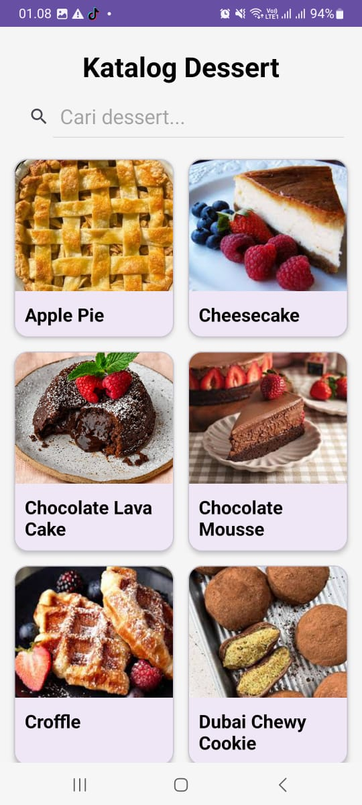
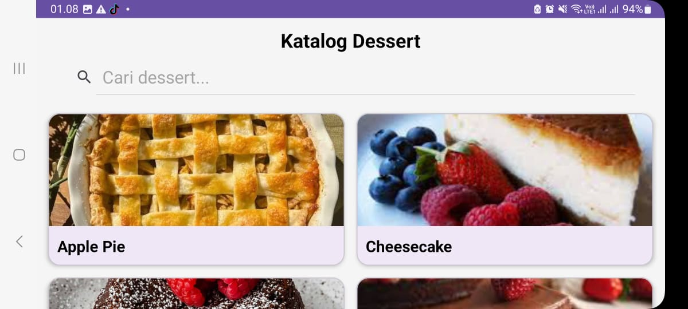
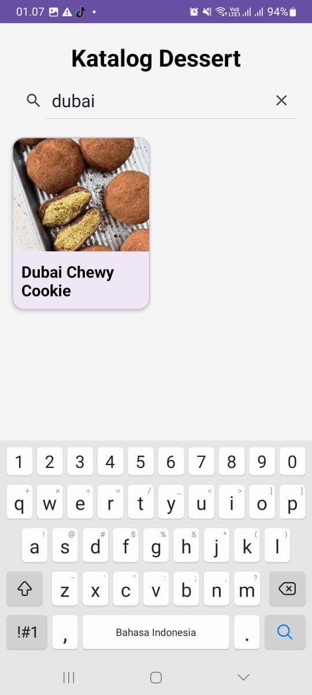
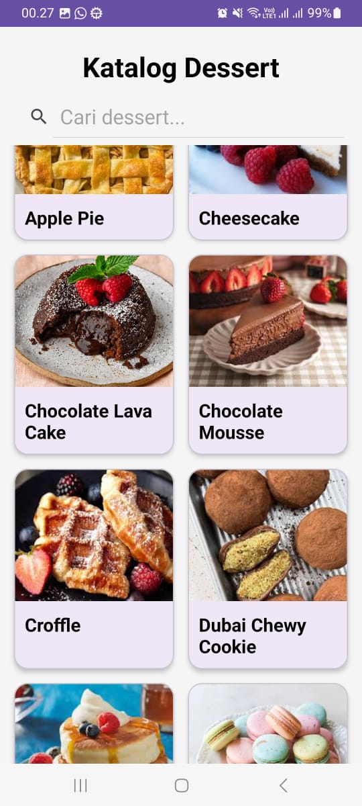
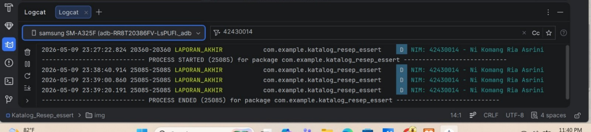

# Laporan Akhir Praktikum Pemrograman Mobile 

- **Nama Lengkap**: Ni Komang Ria Asrini
- **NIM**: 42430014
- **Topik Aplikasi**: Katalog Resep Dessert 

---

## Deskripsi Proyek
Aplikasi "Katalog Resep Dessert" adalah platform informasi resep yang dikembangkan dengan Kotlin. Aplikasi ini mendukung manajemen data menggunakan Array, fitur pencarian real-time, pengurutan otomatis A-Z, serta desain responsif untuk orientasi layar Portrait dan Landscape.

---

##  Screenshot Aplikasi

### 1. Orientasi Layar (Portrait & Landscape)
| Portrait Mode |          Landscape Mode          |
|:-------------:|:--------------------------------:|
|  |  |

### 2. Fitur Pencarian & Pengurutan Data
|      Hasil Pencarian       |     Pengurutan A-Z     |
|:--------------------------:|:----------------------:|
|  |  |

---

##  Debugging & Logcat
Berikut adalah bukti jendela Logcat yang menampilkan Log dari aktivitas aplikasi beserta identitas NIM mahasiswa:

---